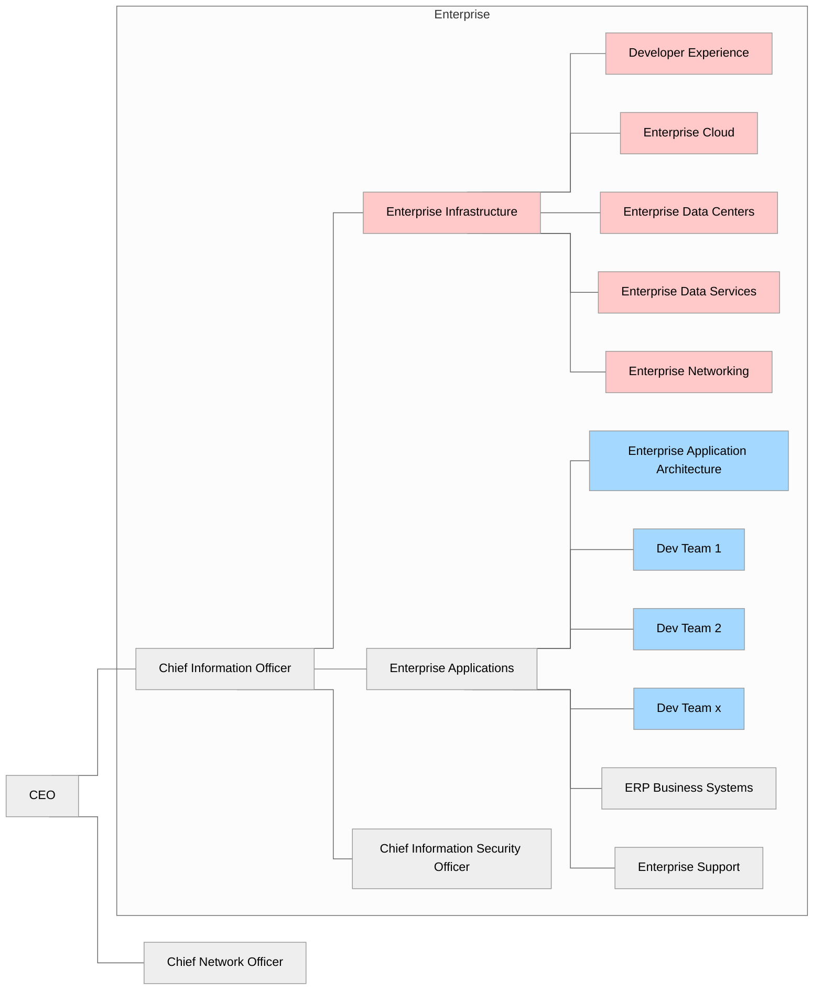
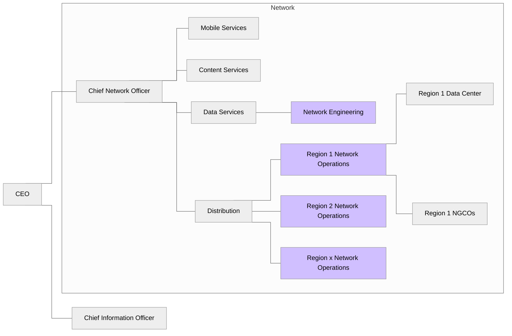

# CableCo Background and Organization

CableCo is a national cable company in the United States. They offer cable television, residential and commercial internet access in 41 states, and mobile telephone service as an MVNO nationwide. CableCo has been on a multi-year journey to modernize all aspects of their operations to use cloud-native technologies. 

### Organizational Structure

CableCo has a highly capable engineering team organized in two separate organizations. 

#### Enterprise

The Enterprise team is led by CableCo's CIO. It is a traditional enterprise IT organization who manages applications for running the business. The Enterprise Application Team is aligned with business units and build and operate applications which perform a wide variety of business functions including customer care, billing, and payment processing. It is split into three organizations: 

1. **Enterprise Application Architecture** – Responsible for setting standards for how applications are built within CableCo. They publish application patterns and shared application components with the goal of minimizing the cost of application development and maximizing reuse across CableCo.
2. **Various Development Teams** – Responsible for in-house developed applications and custom extensions to commercial software. Each team is aligned with a business unit.
3. **ERP Business Systems** – Responsible for configuring and maintaining commercial ERP-style applications
4. **Enterprise Support** – Responsible for providing 24x7 support services for all Enterprise applications.

The Enterprise Infrastructure team is responsible for all infrastructure services for the Enterprise team. This includes:

1. **Developer Experience** – Responsible for maintaining the internal developer platform and operating the CI/CD system.
2. **Enterprise Cloud and Enterprise Data Center** – These two teams are responsible for managing the cloud and on-premises. The includes data center facilities, data center networking, and VMware and OpenStack-based virtual machines.
3. **Enterprise Data Services **– This group is composed of a traditional DBA team who is responsible for the performance and operations of large databases within CableCo as well as the Data Management team which is responsible for all backup and recovery across the company.

#### Network

The Network team is a separate group who manages the entire CableCo network. This includes service provisioning, service metering, and network operations. The Network team manages hardware and software deployed in regional data centers, cloud providers, and in thousands of CableCo edge points of presence across the country. Software-defined networking applications are used to run CableCo's network. These are called network functions. Network functions can be containerized network functions (CNFs) which run on Kubernetes or virtualized network functions (VNFs) which run inside OpenStack virtual machines.

## Enterprise Application Classification

CableCo's enterprise application portfolio is broad and includes simple, internal HR applications, more complex ERP-style applications, and custom developers business applications. Given the breadth, CableCo classifies their enterprise applications across two dimensions: business criticality and deployment type.

Business criticality options include:

- **Prime** – The top five most critical applications within the company. An outage of a prime application has an existential risk to the business. The RTO is 5 minutes with an RPO of 0 minutes. Each prime application will have multiple development, functional test, and integration test environments. The staging environment is a mirror image of the production environment.

- **Critical** – Business critical applications. These applications support ongoing business operations. The RTO is 1 hour with an RPO of 15 minutes. There are 10–20 critical applications within CableCo's application portfolio.

- **Enterprise** – Applications which support a recurring business process but are not critical to the daily operations of the company; e.g., they may support a weekly or monthly business process. The RTO is 1 business day with an RPO of 1 business day. There are 50–100 enterprise applications within CableCo's application portfolio. All testing environments are classified as enterprise applications.

- **Maintenance** – Applications with minimal utility within the company. These applications are not being upgraded or enhanced and are only in maintenance mode, akin to being deprecated. Maintenance applications are deployed in a single availability zone (AZ) with limited high availability beyond simple backups. There is no RTO but have an RPO of 3 business days. There are hundreds of maintenance applications within CableCo's application portfolio. All development environments are classified as maintenance.

Deployment types include:

- **Multi-region** – Multi-region applications are deployed across multiple AZs and multiple regions for the highest availability and lowest client latency. Multi-region applications are complex and difficult to manage. Rather than failing over to another region, multi-regional applications are resilient to a regional outage and will automatically route ingress traffic to another region with consistent data across regions.CableCo maintains a managed network which provides a logical unicast IP address for ingress. Dependent upon the client's location, the network routes the request to the nearest region for that client. Ingress traffic flows to a regional load balancer then to the individual pods managed by a multi-AZ Kubernetes cluster. Databases are replicated within the region and across regions.

- **National** – National applications are a simplified version of multi-region deployments but are only to CableCo's primary cloud region in AWS. These applications run across multiple AZs with automatic failover during an AZ outage, or have automated disaster recovery, dependent upon the application architecture. The majority of CableCo's applications are national.

- **Regional** – Regional applications are similar to national applications but are deployed to a single region of the country to support network operations in one of CableCo's 25 operating regions. These regions run on a mix of AWS and CableCo-owned data centers. 

- **Edge** – Edge applications are to one of CableCo's 1,500 next-generation central office (NGCO) locations, which are used to operate CableCo's network as well as to provide edge compute capabilities for CableCo's businesses and customers. These are also referred to as points of presence or edge locations. For network functions, CableCo uses a blue/green deployment methodology starting with a single edge location then gradual rollout site-by-site with increasing frequency. The benefit of edge locations is that all edge applications are non-persistent. Any data they capture is shipped to a regional or national application.

## Developer Platform

Developers at CableCo are served today by different groups, each offering a different service.

* The Developer Experience team offers a managed Kubernetes namespace as a service. For Enterprise and Maintenance applications, developers can request a Kubernetes namespace via a form. For Prime and Critical applications, the Developer Experience offers one on one consulting with development teams to meet the business-critical availability and resiliency requirements. 
* The Developer Experience team also offers a managed CI/CD service using GitLab and ArgoCD.
* The Enterprise Cloud team offers AWS accounts to development teams. These AWS accounts come pre-configured with IAM roles and shared VPCs with Direct Connect to the CableCo wide-area network. Developers are free to use whatever IaC solution they like but Terraform is very common in CableCo. The Developer Experience team uses this service to offer the managed Kubernetes service in AWS.
* The Enterprise Data Center team offers virtual machines as a service to development teams using either OpenStack or VMware. The Developer Experience team uses this service to offer the managed Kubernetes service on-premises.
* The Enterprise Data Services team is the DBA team. They offer managed Oracle, PostgreSQL, and MySQL on-premises and in AWS. These managed databases are regularly backed up, monitored, and updated. Options are available for multi-location replication for availability and resiliency. NoSQL databases are left to the development team to manage.

